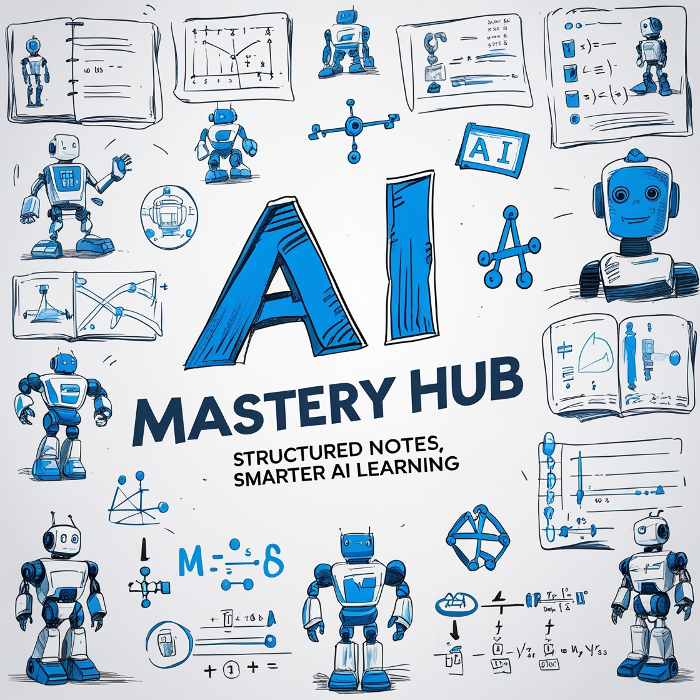

# AI Mastery Hub

Welcome to my personal **Generative AI Learning Journal** – a curated space where I document my journey into the world of **Artificial Intelligence** and **Generative AI** 🌟

<p align="center">
  
</p>

Whether you're just getting started, already deep into prompts and models, or somewhere in between – feel free to explore, learn, and contribute!

---

## 🌐 Portfolio

Check out my full portfolio and other works on my [Personal Website](https://sukritic.vercel.app/).

---

## 🚀 Projects & MVPs Index  &nbsp; 🆕

> Practical implementations of ideas explored through my learning journey.

### 1. 📦 Projects I Shipped

1. 📚 **[TBRly](https://tbrly-app.vercel.app/)** - *Newly Launched!*  🔥

   TBRly is a Progressive Web App (PWA) designed for the reading community to gamify and automate their monthly "To Be Read" (TBR) lists. Leveraging Google Vertex AI, TBRly seamlessly integrates with users' reading habits to curate personalized reading selections.  
     
   *(Support the [Product Launch](https://tbrly-app.vercel.app/))*

   <a href="https://www.producthunt.com/products/tbrly/reviews/new?utm_source=badge-product_review&utm_medium=badge&utm_source=badge-tbrly" target="_blank"></a>

2. 🌾 **Land Image Analyser**  
   AI-powered AgriTech MVP built using **FastAPI**, **Google Cloud Run**, **Vertex AI**, and **Gemini 2.5 Pro**.

### 2. 📖 Open Source Projects

1. 🗂️ **ZeroTab**  
   Zero-dependency LRU tab eviction daemon built with Python asyncio to profile browser activity and compress idle tabs.  
   [🔗 GitHub Repository](https://github.com/SukritiC/ZeroTab) | [📺 YouTube Playlist](https://www.youtube.com/watch?v=QR7K-y9XEA4&list=PLeeRjwRjXe5Y)
2. ⚙️ **Poly config**  
  Type-safe configuration compiler with zero external dependencies. Eliminates format drift, prevents circular variable reference loops, and enforces schema safety in CI/CD pipelines.  
   [🔗 GitHub Repository](https://github.com/SukritiC/Poly-Config) | [📺 YouTube Playlist](https://www.youtube.com/watch?v=QR7K-y9XEA4&list=PLeeRjwRjXe5Y)
3. 🌍 **GeoShift-Change-Detection**  
   GeoShift is an MVP system that detects and visualizes landscape changes using multi-temporal satellite imagery.  
   [🔗 GitHub Repository](https://github.com/SukritiC/GeoShift-Change-Detection) | [📺 YouTube Playlist](https://www.youtube.com/watch?v=_eqrNr8JZlc&list=PLUlKq_lSKQiOMmrHGozPlZOLDXdEVa5z_)
   
   ---

## What's Inside?

- 📓 **Session Notes**: Clean summaries from webinars, conferences, YouTube videos, or hands-on workshops.
- 🧾 **Concept Breakdowns**: Easy-to-understand explanations of complex topics like Transformers, Diffusion Models, LLMs, etc.
- 🧩 **AI Projects & MVPs**: End-to-end, hands-on implementations of AI and GenAI ideas — built to explore real-world applications of learned concepts.  
  Includes projects like:  
  - **Land Image Analyser** – AI-powered AgriTech MVP using Google Cloud Run, Vertex AI & Gemini 2.5 Pro.
  - **GeoShift-Change-Detection** - GeoShift is an MVP system that detects and visualizes landscape changes using multi-temporal satellite imagery.
- 🔗 **Notion Links**: Published notes hosted on Notion for better readability.
- 🛠️ **Resources**: Books, YouTube channels, GitHub repos, tools & Sample codes etc...

---
## 📁 Folder Structure

```bash
ai-mastery-hub/docs/
📁 /notes/
   ├── Projects-MVP  
   │   ├── 01-TBRly/ 🔥
   │   │   └── README.md 🔥
   │   ├── 02-AI-land-image-analyzer/ 
   │   │   └── README.md 
   │   ├── 03-GeoShift-Change-Detection/ 
   │   │   └── README.md 
   │   │   └── Building GeoShift Youtube Playlist 
   │   
   ├── 01-google-agentspace/
   │   ├── notes.md
   │   ├── adk/
   │   │   ├── agen-with-agent-engine-in-vertex-ai.md 
   │   │   ├── agent-in-vertex-ai-sample-code/
   │   │   │   └── intro_agent_engine-v2.0.0.ipynb
   │   │   │ 
   │   │   ├── agent-development-kit.md
   │   │   ├── adk_project/
   │   │   │   └── app_agent/
   │   │   │   └── llm_auditor/
   │   │   │   └── my_google_search_agent/
   │   │   │
   │   │   ├── adk_tools/
   │   │   │   └── crewai_tool_agent/
   │   │   │   └── function_tool_agent/
   │   │   │   └── langchain_tool_agent/
   │   │   │   └── vertexai_search_tool_agent/
   │   │   │
   │   │   ├── adk_multiagent_systems/
   │   │   │   └── parent_and_subagents/
   │   │   │   └── workflow_agents/
   │   │   │
   │   │   └── adk_to_agent_engine/
   │   │       └── transcript_summarization_agent/
   │   │   
   │   ├── gemini-code-assist/
   │   │   └── gemini-code-assist.md
   │   
   ├── 02-professional-machine-learning-engineer/
   │   └── Introduction.md
   │   └── data-preparation-and-modelling.md
   │   └── responsible-ai-for-devs-privacy-and-safety.md
   │   └── part1-engineering-data-for-predictive-modelling-with-bigqueryml.md
   │   └── build-train-deploy-ml-models-with-keras-on-google-cloud.md
   │      
   ├── 03-data-engineer-learning/
   │   └── using-gemini-in-bigquery.md
   │   └── work-with-gemini-models-in-big-query.md
   │
   ├── 04-deploy-and-manage-gen-ai-models/
   │   └── ml-ops-for-gen-ai.md
```

---

## 📚 Notes Index

> A growing list of everything I’m learning in the GenAI space:

1. **Study Notes on Agentic AI**
   1. Google Agentspace
   2. Agent Development Kit - Part 1 & 2
   3. App Development with Gemini Code Assist 
   4. Build and Deploy an Agent with Agent Engine in Vertex AI - **Hands On Lab**
2. **Study Notes for Professional Machine Learning Engineer**
   1. Introduction
   2. Data Preparation & Modeling
   3. Build, Train & Deploy ML Models with Keras on Google Cloud
   4. Predictive Modelling with BigQuery ML - Part 1
   5. Responsible AI for Dev's Privacy and safety
3. **Study Notes for Data Engineering**
   1. Using Gemini in BigQuery
   2. Work with Gemini Models in BigQuery
4. **Study Notes for Deploying & Managing Gen AI Models**
   1. MLOps with Vertex AI : Model Evaluation
   
---


## <a href="https://www.youtube.com/channel/UC9QJnm18hr2fBB5-BPXVv3w" target="_blank"> Fresh from my YouTube - Technical Insights</a>

> Staying active and sharing knowledge through quick educational shots and deep dives.

<table>
<tr>
    <td width="50%" colspan="2">
      <a href="https://youtu.be/2IAuzL4zHXw" target="_blank">
        
      </a>
      <p align="center"><strong>Product Demo - TBRly</strong></p>
    </td>
</tr>
  <tr>
    <td width="50%">
      <a href="https://youtube.com/shorts/HdSgWNIaNiw" target="_blank">
        
      </a>
      <p align="center"><strong>TBRly UI</strong></p>
    </td>
    <td width="50%">
      <a href="https://www.youtube.com/shorts/r3jE45ekJvM" target="_blank">
        
      </a>
      <p align="center"><strong>Docker Setup for Local Dev (Fast & Clean)</strong></p>
    </td>
  </tr>
  <tr>
    <td width="50%">
      <a href="https://www.youtube.com/shorts/M9xUHmQM7g0" target="_blank">
        
      </a>
      <p align="center"><strong>Dark Mode Toggle in React — Surprisingly Easy</strong></p>
    </td>
    <td width="50%">
      <a href="https://www.youtube.com/watch?v=OfVCkquWBR4" target="_blank">
        
      </a>
      <p align="center"><strong>Project MVP of Land Image Analyser</strong></p>
    </td>
  </tr>
</table>

---

## 📖 How to Use / Read the Notes

Each topic in the **AI Mastery Hub** is neatly organized within its own subfolder. To help you navigate and absorb the content efficiently, every subfolder contains a dedicated `README.md` with the following details:

- **📌 Title of the Topic**  
  Clearly indicates the subject or focus area (e.g., "Google Agentspace", "Using Gemini in BigQuery", etc.).

- **🔗 Published Notes Link**  
  Direct link to the polished, readable version of the notes.

- **📝 Summary**  
  A short overview of what the notes cover—helpful to get a quick idea before diving in.

- **📚 Table of Contents**  
  Bullet points or nested lists summarizing the key sections, topics, or concepts explained in the linked notes.

> 📂 **Pro Tip:** Start with the folder or topic you’re currently exploring in your learning journey, by using the above **Notes Index**. Use the published link for a better reading experience, and refer to the summary and table of contents for focused revision or selective deep-dives.

---

## 📌 Why I Made This

I wanted to:

- 🧠 Stay consistent in my AI/Gen-AI learning journey
- ⚡ Simplify complex concepts into digestible notes
- 🔄 Refer back to resources quickly
- 🤝 Share my learnings with the community
- 🛠️ Build a habit of documenting while learning

---

## 🙌 Contributions Welcome

If you:

- Found a cool new resource or session worth noting
- Spotted an error or outdated link
- Want to collaborate or extend these notes

Feel free to:

- Open a **Pull Request**
- Submit an **Issue**
- Or just reach out directly on [LinkedIn](https://www.linkedin.com/in/sukritichatterjee/)

---

## 🤝 Share the Knowledge

Found these notes helpful?  
Feel free to share them with your peers, friends, or anyone in your learning circle who might benefit from them. Learning is better when it’s collaborative!

> ⚠️ Please note: These notes are shared under the [MIT License](./LICENSE). While you're welcome to use, modify, and share them, make sure to provide proper credit and include the original license file if you redistribute or adapt the content.
---

## 💬 Let's Connect

<table align="center">
  <tr>
    <td align="center">
      <a href="https://www.linkedin.com/in/sukritichatterjee/" target="_blank">
        
      </a>
    </td>
    <td align="center">
      <a href="https://github.com/SukritiC" target="_blank">
        
      </a>
    </td>
    <td align="center">
      <a href="https://sukriti-speaks.medium.com/" target="_blank">
        
      </a>
    </td>
    <td align="center">
      <a href="https://www.youtube.com/@TechDev_Insights" target="_blank">
        
      </a>
    </td>
    <td align="center">
      <a href="https://x.com/SukritiSpeak" target="_blank">
        
      </a>
    </td>
    <td align="center">
      <a href="https://www.instagram.com/tech.dev_insights/" target="_blank">
        
      </a>
    </td>
    <td align="center">
      <a href="https://sukritic.vercel.app/" target="_blank">
        
      </a>
    </td>
    <td align="center">
      <a href="https://dev.to/sukriti_c" target="_blank">
        
      </a>
    </td>
    <td align="center">
      <a href="https://www.producthunt.com/products/tbrly?launch=tbrly" target="_blank">
        
      </a>
    </td>
  </tr>
</table>

<br/>

🔗 [Personal Website](https://sukritic.vercel.app/)
🔗 [Commudle Profile](https://www.commudle.com/users/SukritiC)
🔗 [Google Cloud Badges](https://www.cloudskillsboost.google/public_profiles/53df2710-444d-4f31-9c37-6c87dfcf102f)
🔗 [Accredible Credential](https://www.credential.net/profile/sukritichatterjee/wallet)
🔗 [Credly Badges](https://www.credly.com/users/sukriti-chatterjee.aadce67f)


> I'm always up for a good AI chat or knowledge exchange — feel free to drop a message!

---

## 📄 License
This project is licensed under the [MIT License](LICENSE).

