# TBRly: AI-Powered Reading Roulette 📚

  
  
  

  

## Project Abstract
TBRly is a Progressive Web App (PWA) designed for the reading community to gamify and automate their monthly "To Be Read" (TBR) lists. Leveraging Google Vertex AI, TBRly seamlessly integrates with users' reading habits to curate personalized reading selections.

## Project Objective
The primary objective of TBRly is to help readers conquer decision paralysis by transforming their reading backlog into a highly visual, gamified experience. Instead of endlessly scrolling through a list, TBRly provides an interactive environment where users can rely on "The Spin" for a quick randomized choice, or enter "The Arena" to vote for their next read through a tournament bracket.

## 🔗 Live App URL: [https://tbrly.vercel.app/](https://tbrly.vercel.app/)

   

## Product Demo 🎬
<table>
<tr>
    <td width="50%" colspan="2">
      
      
<strong>Product Demo - TBRly</strong>

    </td>
    </tr>
</table>

## UI Highlights & Layout

TBRly is designed with an immersive, themeable architecture separated into key visual zones:

  

### 1. The Category Panel (Left)
The left side panel acts as your control center. It displays your current theme's primary icon (e.g., a Basket for Cottagecore, a Candle for Dark Academia) and contains the main controls for building your backlog. It also houses the **Mode Toggle**, allowing you to instantly switch the center stage between the quick Roulette spin and the gamified Bracket tournament.
<table align="center" border="0" cellpadding="0" cellspacing="0" style="margin-top: 10px; margin-bottom: 20px;">
  <tr>
    <td align="right" valign="top" style="padding-right: 15px;">
      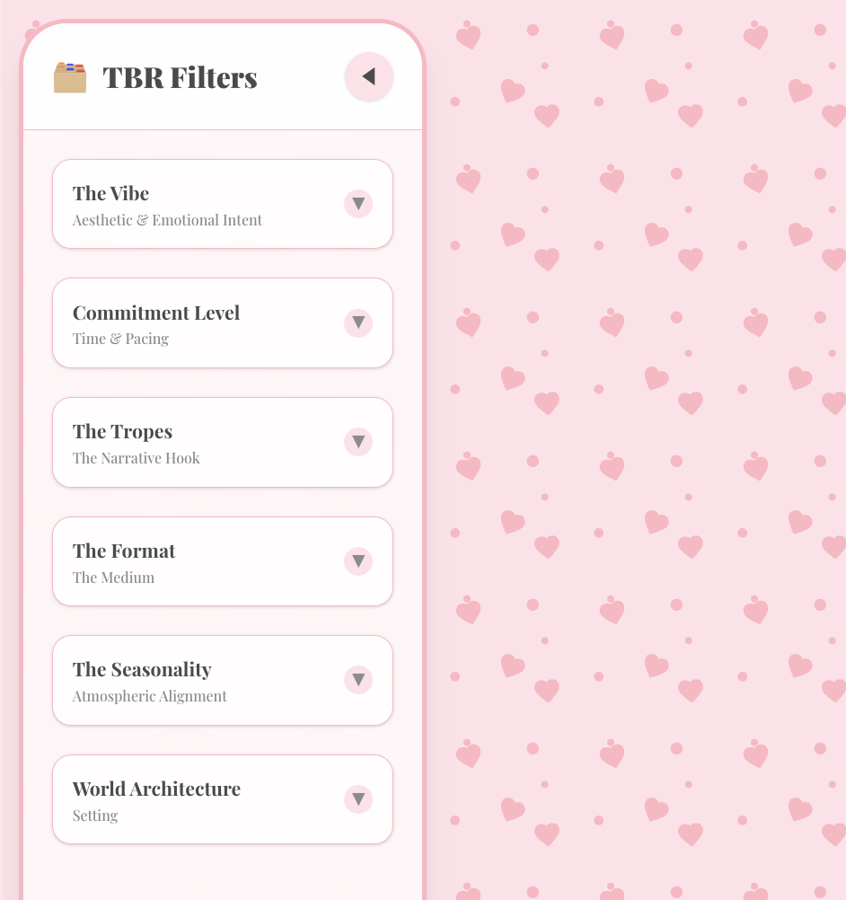
    </td>
    <td align="left" valign="top" style="padding-left: 15px;">
      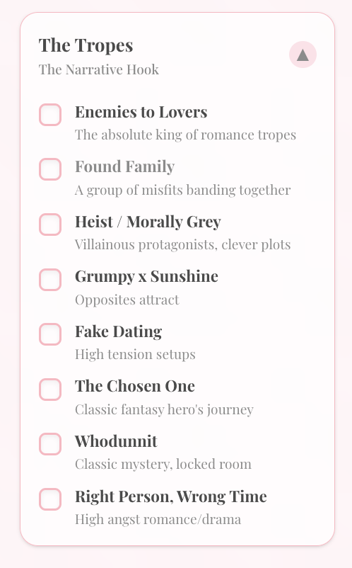
      

      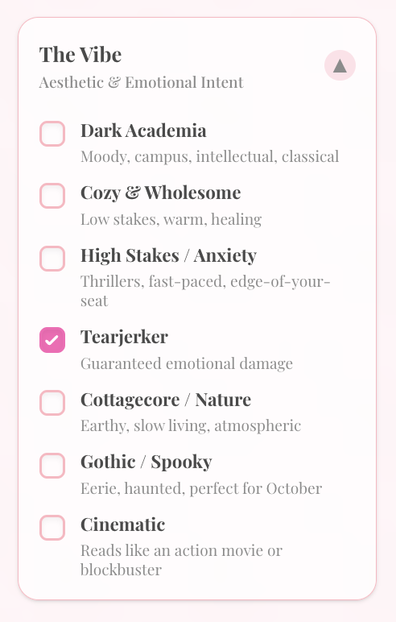
    </td>
  </tr>
</table>

### 2. The Center Stage (TBR Display)
The heart of the application where your TBR is decided. Depending on your selected mode, this section dynamically transforms:
- **Roulette Mode:** Displays the "Spin" button and flashes through your books before landing on your next read.
- **Arena Mode:** Transforms into a tournament battlefield, displaying animated 1v1 matchups with a "Winner's Circle" at the bottom to track books secured for the next round.

  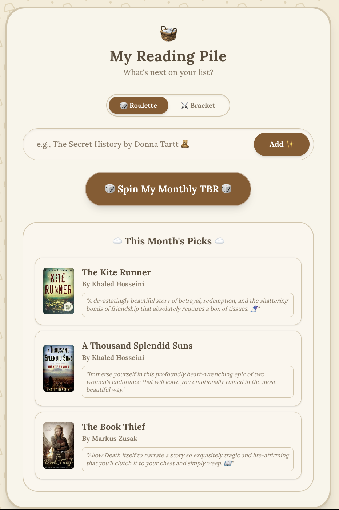

### 3. The Shelf (Right Panel)
Your personal library. This right-side panel displays all the books you've added to your backlog. It serves as your inventory—if your shelf grows to 8 books, the Arena automatically scales up to a full Quarterfinals tournament.

  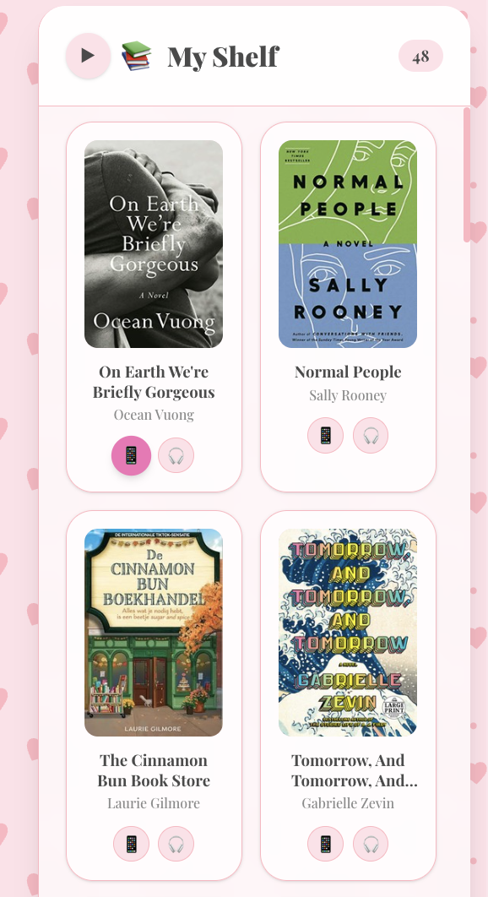

### 4. Dynamic Theming
The theme buttons allow users to switch the entire application's aesthetic on the fly. The colors, typography, borders, and UI elements smoothly transition between curated aesthetics like Minimalist, Coquette, Cottagecore, and Dark Academia, ensuring the app always matches the reader's current vibe.

  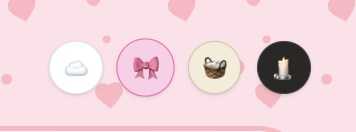

<table align="center" border="0" cellpadding="0" cellspacing="0" style="margin-top: 20px;">
  <tr>
    <td align="center" style="padding: 10px;">
      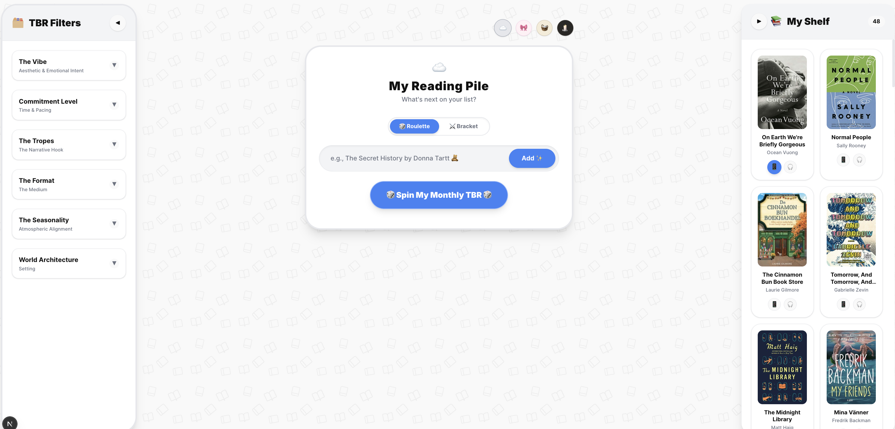
       <b>☁️ Minimalist</b>
    </td>
    <td align="center" style="padding: 10px;">
      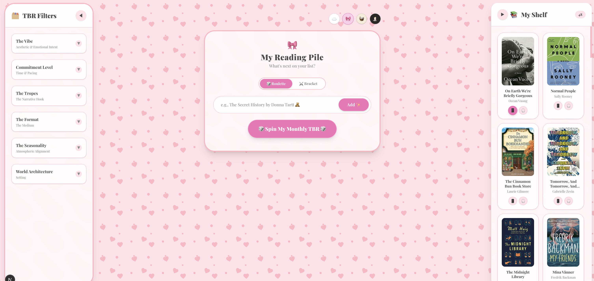
       <b>🎀 Coquette</b>
    </td>
  </tr>
  <tr>
    <td align="center" style="padding: 10px;">
      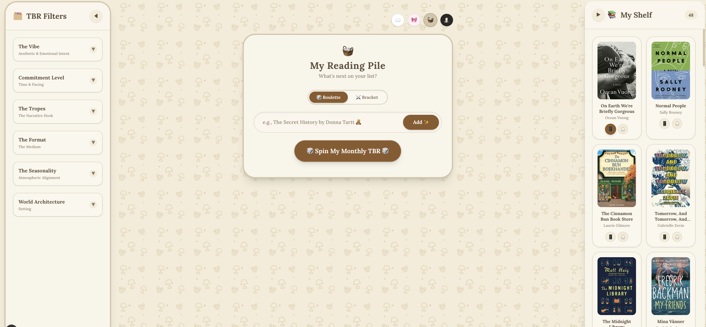
       <b>🧺 Cottagecore</b>
    </td>
    <td align="center" style="padding: 10px;">
      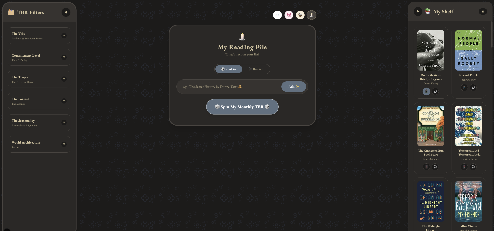
       <b>🕯️ Dark Academia</b>
    </td>
  </tr>
</table>

## Feature Listing

1. **Manual Book Addition:** Instantly add physical or digital books to your backlog manually. The system hooks into Google Books and OpenLibrary APIs to autocomplete book metadata (covers, blurbs, genres, page counts) as you type.

  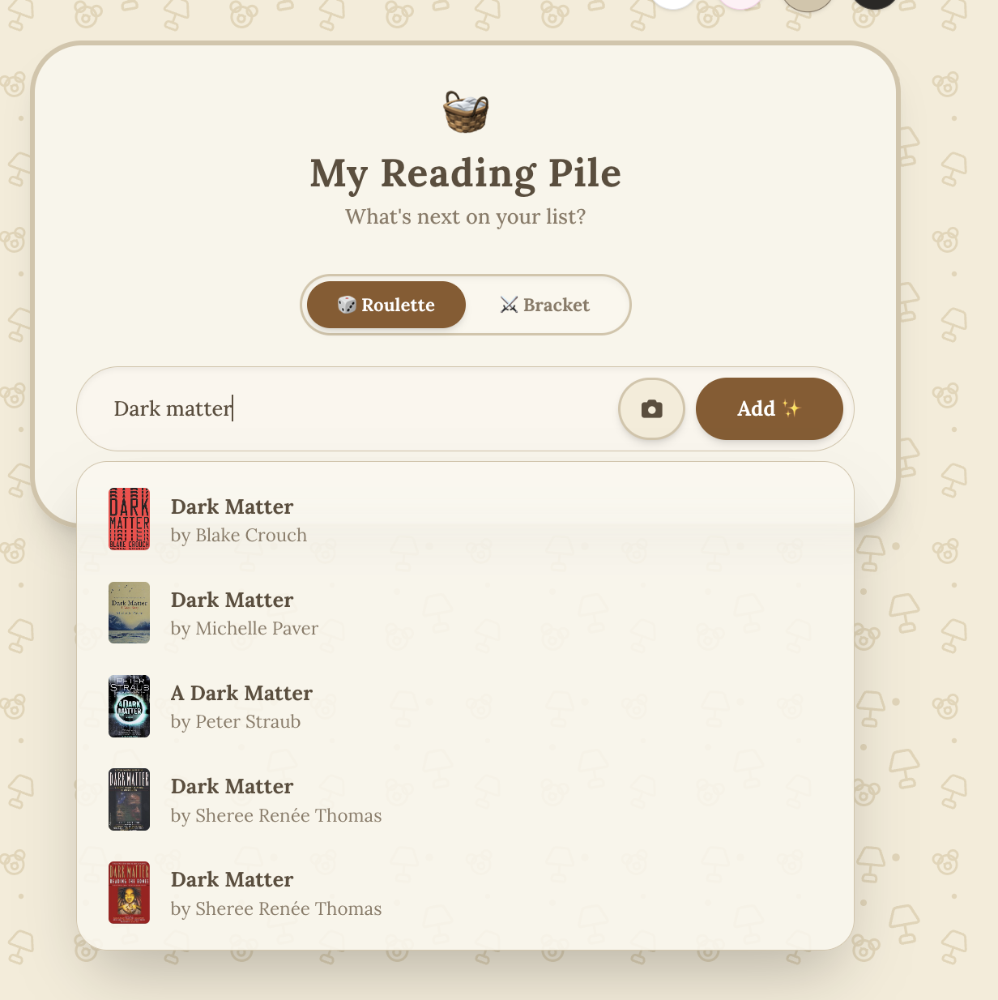

2. **Roulette Spin & TBR Filters (Free):** Overwhelmed by choice? Filter your backlog by specific vibes or formats, and use the sleek Roulette Mode to let the system randomly spin and select your monthly TBR for you.

  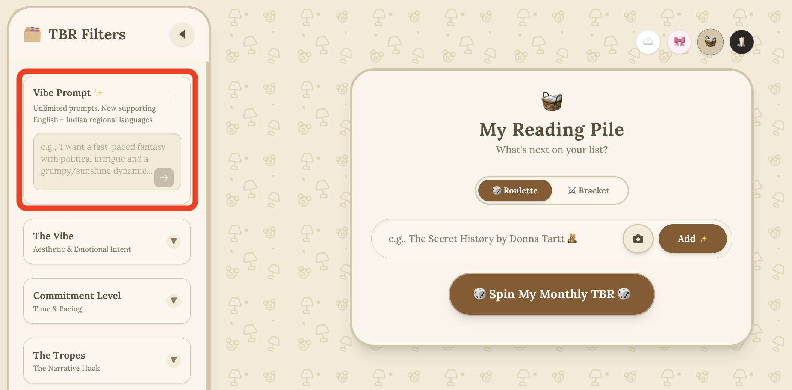

3. **The Arena Tournament Bracket (Free):** An immersive gamification engine where 8 books are selected via a Fisher-Yates shuffle and placed into a March-Madness style elimination bracket. Users vote on pairs through animated rounds until a single "Champion" emerges.

  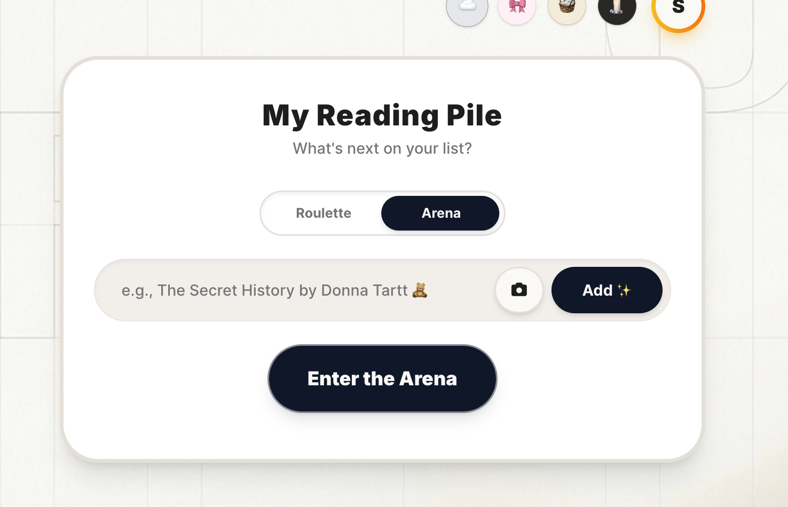

4. **The Bookshelf Scanner (TBRly Pro):** Users snap a photo of their physical bookshelf. Vertex AI (Gemini 2.5 Pro) extracts titles via OCR and instantly builds a digital database within TBRly. Cover art and blurbs are fetched silently in the background!

  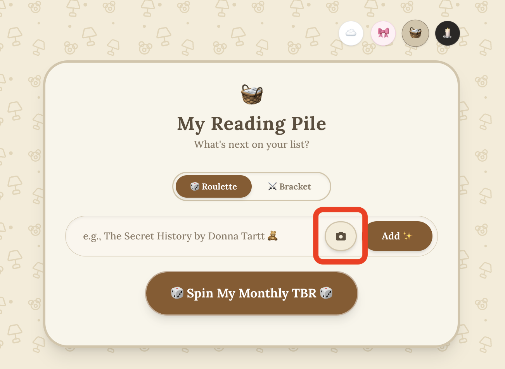

5. **The Vibe Prompt (TBRly Pro):** Vertex AI curates your next read based on abstract moods (e.g., "A book that feels like an autumn evening"). It fully supports understanding major Indian languages (Hindi, Kannada, Tamil, etc.) while returning aesthetic English recommendations.

  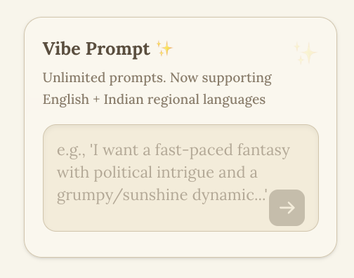

6. **Viral Buddy Reads:** Generate beautiful server-side OpenGraph preview images of your curated monthly picks to share effortlessly on social media or messaging apps.

  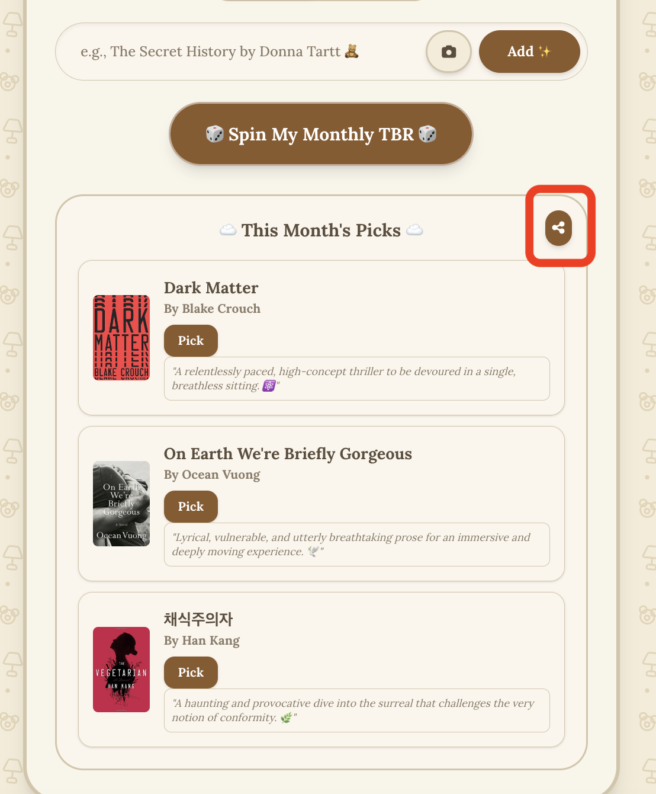

7. **Bookshelf Details & Reading Archives:** A dedicated virtual shelf holding your backlog. It automatically cross-references your Reading History, adding stylish **DNF** (Did Not Finish) or **RE-READ** visual banners to books you've already interacted with.

  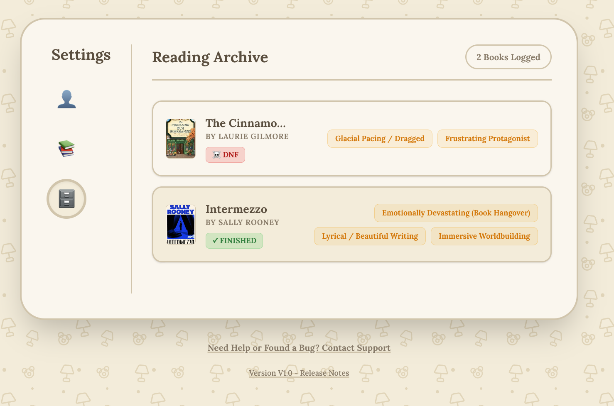

8. **Reading Stats:** Track your reading journey! A beautifully themed user profile dashboard displays your total books read, DNF count, and other fun reading statistics.

  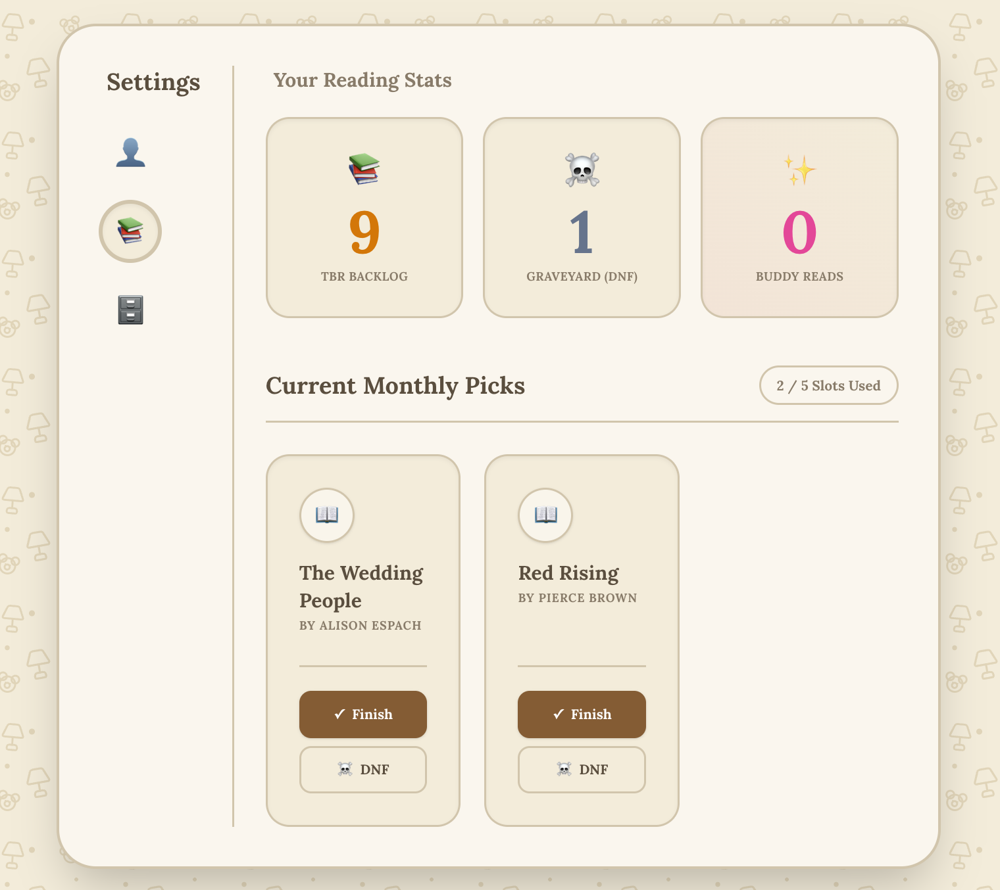

## System Architecture & Resiliency
This micro-SaaS is built for zero-maintenance scalability, absolute isolation of backend resources, and rapid cloud deployment.
* **Frontend Development:** Next.js (App Router), Tailwind CSS, PWA-compliant manifest service workers.
* **Backend Framework:** Python, FastAPI pipeline.
* **Data Layer & Security:** Firebase Firestore. Hardened via multi-stage Firestore Security Rules to isolate user namespaces and lock premium mutation permissions.
* **Secrets Management:** Fully integrated with **GCP Secret Manager** to securely isolate serverless API tokens and database keys away from code runtimes.
* **AI Compute Engine:** GCP Vertex AI (Gemini 2.5 Pro) for structured OCR text extraction and low-latency semantic mood processing.
* **Monetization Interface:** LemonSqueezy platform configuration for Merchant of Record global transaction handling.
---

### 🔗 Live App URL: [https://tbrly.vercel.app/](https://tbrly.vercel.app/)

   

   ## Product Demo 🎬
<table>
<tr>
    <td width="50%" colspan="2">
      
      
<strong>Product Demo - TBRly</strong>

    </td>
    </tr>
</table>
   
---

## Connect with Me

I'm always excited to connect with fellow **developers**, **AI enthusiasts**, and **innovators**. Whether you're building in the **Generative AI** space, looking to collaborate, or just want to talk tech—let's connect and create something impactful!

  
   
  
   
  

## 🔐 License & Copyright
Copyright (c) 2026 Sukriti Chatterjee. All rights reserved. 
The architectural designs, schemas, and documentation text contained in this repository are proprietary. No unauthorized replication, distribution, or commercial modification is permitted.