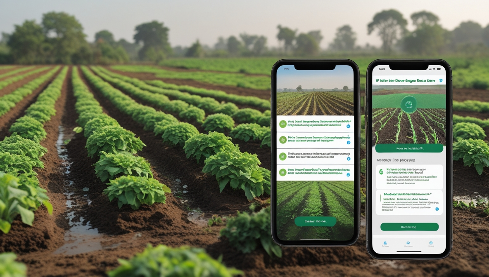
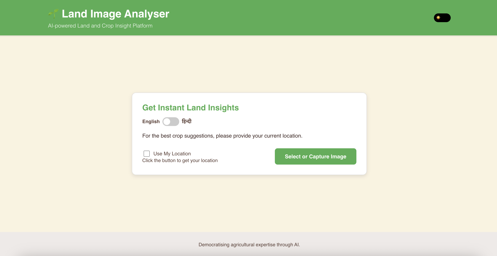
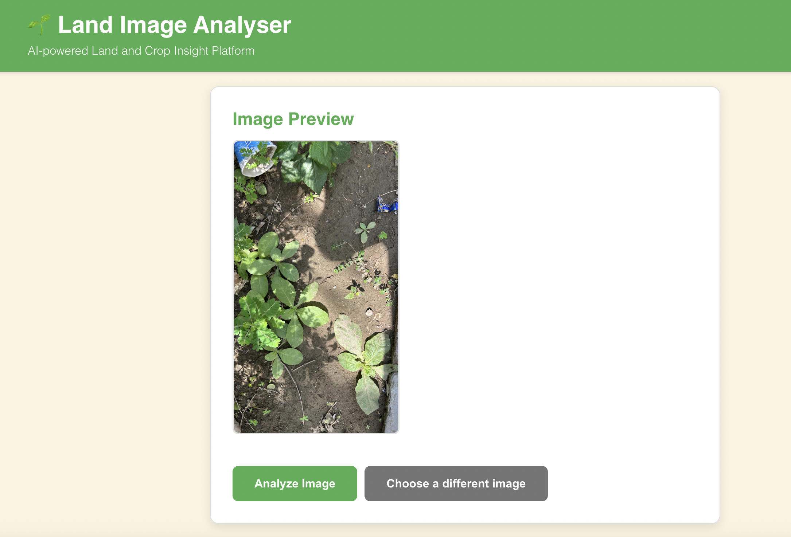
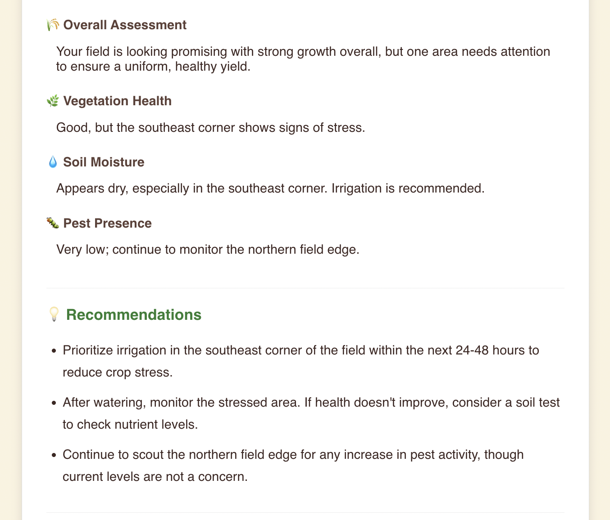
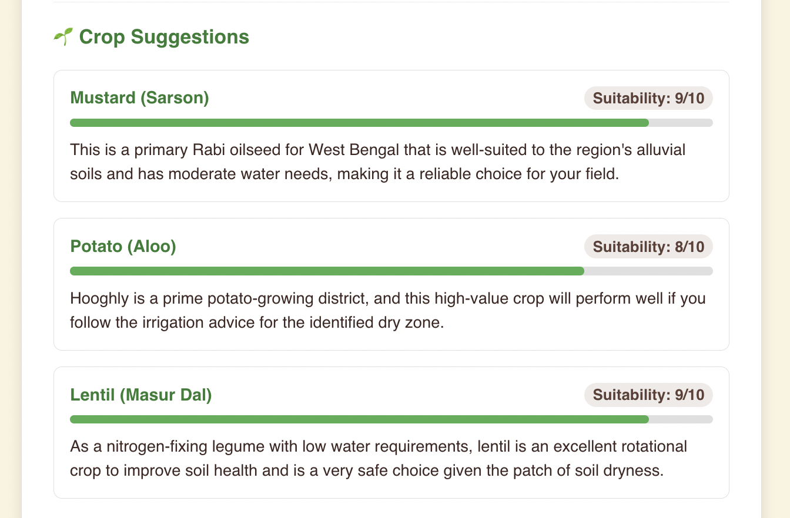
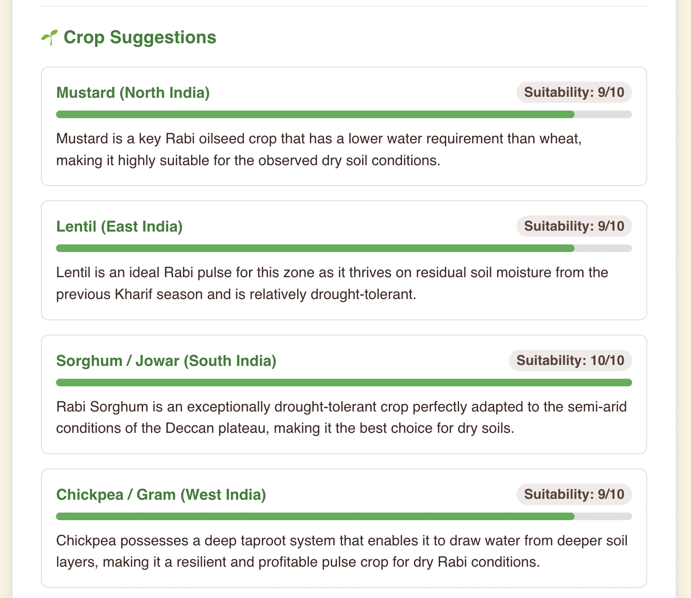
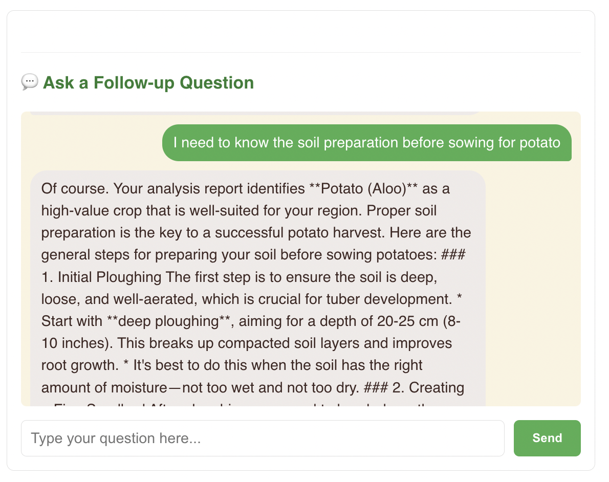

# 🌿 Land Image Analyser   
**AI-powered land and crop insights — just upload a photo and get instant analysis.**

  <!-- TODO: Replace this placeholder with a high-quality GIF or screenshot of the application in action. -->
  

---

## 📖 Overview

Explore the complete journey of the Land Image Analyser — from idea to working MVP — through a detailed video demo and an in-depth technical blog.

### **MVP Video Demo** &nbsp;&nbsp;&nbsp;  

Experience the end-to-end walkthrough of the project — covering the architecture, Google Cloud setup, and real-time AI insights in action.
[Watch the MVP Demo on YouTube](https://youtu.be/OfVCkquWBR4)

### **Deep Dive into the MVP Blog** &nbsp;&nbsp;  

Dive into the complete story behind the build — the problem statement, solution design, and lessons learned while developing this AI-powered land analysis MVP.
 [Read the Full Blog on Medium](https://sukriti-speaks.medium.com/land-image-analyzer-ai-powered-land-crop-insight-platform-fcca6c8c6065)

> ⚠️ Note: The source code for this project is not public at this time.

---

## ✨ MVP Prototype Glimpse
Here’s a quick look at how the Land Image Analyser Landing Page looks like. 

  

A user uploads an image, asks a question, and receives an instant, AI-driven analysis.
 
  
  
  
Crop Suggestion Given : with or without Location tracking enabled respectively ⬇️
 
  
  
  
Chat Option Given : To ask follow-up questions ⬇️
 
  
 

---

## 🎯 About The Project

Millions of farmers across rural regions face challenges in obtaining timely, reliable, and affordable insights about their land.  
Traditional methods such as expert visits and lab tests are often **slow, expensive, and inaccessible**.

**Land Image Analyser** aims to change that — offering a **simple, instant, and intelligent AI tool** that works even on a basic smartphone.

Just **upload a photo** of your land and receive:
- **Instant insights** on vegetation health, soil dryness, pest presence, and crop readiness.  
- **Actionable recommendations** to guide next steps.  
- The ability to **ask natural language questions** like:  
  > “Is this land ready for sowing?”

---

## ✨ Key Features

✅ **Instant AI Analysis** — Get real-time insights on land conditions.  
✅ **Actionable Recommendations** — Receive easy-to-understand summaries (e.g., “Soil moisture is moderate,” “Preventive spraying advised”).  
✅ **Natural Language Q&A** — Ask questions about your image and get intelligent, context-aware answers.  
✅ **Multi-Language Support** — Available in **English**, **Hindi**, and **Bengali** for regional accessibility.  

---

## 🛠️ Tech Stack & Architecture

The platform is built using a **modern, scalable, serverless architecture** to ensure performance and reliability.

| Component | Technology Used                                                    |
|------------|--------------------------------------------------------------------|
| 🖥️ **Frontend** | React.js (Single-Page Application)                                 |
| ⚙️ **Backend** | FastAPI deployed on Google Cloud Run                               |
| 🧠 **AI & ML** | Google Vertex AI with Gemini 2.5 Pro                               |
| ☁️ **Storage** | Google Cloud Storage (image uploads)                               |
| 🔄 **Post-Processing** | Google Cloud Functions (async image resizing, metadata extraction) |
| 🌐 **Translation** | Google Cloud Translation API (multi-language support)              |

---

## 🤝 Contributing

While the **codebase is not open-source**, we welcome **contributions** in the form of ideas, research insights, and conceptual feedback.  

Got a suggestion or feature idea?  
📬 Open an issue in this repository — your domain expertise can help shape the future of this platform.

  
  Made with ❤️ & powered by <b>AI</b> for a sustainable future.  

---

## 📄 License

This documentation and conceptual content are distributed under the **MIT License**.  
See the [LICENSE](./LICENSE) file for more information.

---
## 📬 Connect with Me  

I’m always open to connecting with **developers**, **AI enthusiasts**, and **innovators** working on **Generative AI projects**.  
Let’s connect, collaborate, and create impact together!

  
  
   
    
  

---

  💬 Let’s exchange ideas on <b>Generative AI</b> and build something extraordinary together. 🌍  

---
